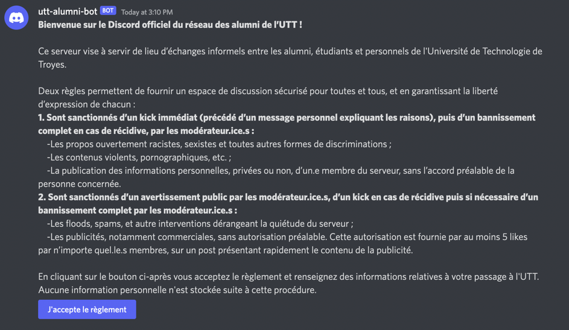
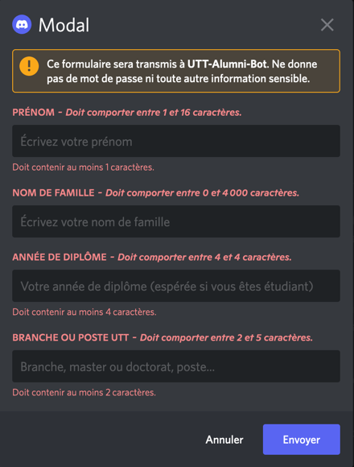
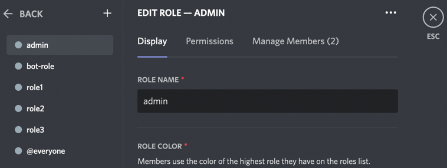

# Boarding Duck
The best discord bot ever to manage newcomers on a Discord server.

## Details
The bot display the rules on an empty channel. If the channel is not empty,
no message is post.



When the user accept the rules, a modal ask some information about the user.



Once the user validate the modal, its nickname is updated, a role is
given to him, and an ephemeral welcome message is displayed (just for him).

## Configuration
### Discord developer settings
On your Discord user settings, activate the developer settings in the advanced section. It will
allow you to access channel and role IDs.

### Connect to the server
To set up the bot, edit the config.json file:
- token: the token to log the bot to your server
- server: the server ID. You can find it in the Widget section of your server's settings.
- channel: the channel where the bot display the rules. On the channel list, right-click on the channel and copy its ID.
- role: the role to add to the user once he accepts the rules and submits the modal. In the role list, right-click on the role and copy its ID.

### Discord server settings
This bot gives permissions to other users. Discord has a non-intuitive way of allowing permissions. The role
of the bot must be in a higher position in the role list than the role it will give.

For example, if the bot has the role "bot-role", and that the roles "role1", "role2" and "role3"
exist, and if the bot gives the role2 role to the user, the bot-role must be above role2, as in this example:



### Permissions
This bot need the following permissions:
- General
  - Manage Roles (to add a role to a user)
  - Manage Nicknames (to update users' nickname)
  - Read Messages/View Channels (to check if the welcome message has already been sent)
- Text Permissions
  - Send Messages
  - Embed Links
  - Read Message History (to retrieve previous message of the channel where to write the welcome message if needed)

It can be added by accessing this URL:
[https://discord.com/api/oauth2/authorize?client_id=1035919632810381442&permissions=402738176&scope=bot](https://discord.com/api/oauth2/authorize?client_id=1035919632810381442&permissions=402738176&scope=bot)

It will ask you on which server you want to set the bot. Be sure to have the appropriate permissions to do so.

Once set, give the appropriate permissions to the bot on the channel you want to use. See [this part](#discord-server-settings).

## Develop
To run the bot:
- `npm install`
- `npm start` or `npm run start-dev` for loading a local `config-dev.json` file.

## Install the bot as a service
Create a service file (for example `/etc/systemd/system/boarding-duck.service`):

```
[Unit]
Description=Boarding duck
After=network.target
StartLimitIntervalSec=0

[Service]
Type=simple
Restart=always
RestartSec=1
ExecStart=node /path/to/boarding-duck/bot.js --config /path/to/boarding-duck/config.json

[Install]
WantedBy=multi-user.target
```

You must change the ExecStart field.

Don't forget to install node dependencies beforehand.

To start the service:
`systemctl start boarding-duck`

To automatically start the service at system boot:
`systemctl enable boarding-duck`

To access the service logs:
`journalctl -u boarding-duck -n 200 -f`


## Start the bot in a container

1. Clone the project: `git clone https://github.com/UTT-Alumni/boarding-duck.git`
2. Go to the boarding-duck folder: `cd boarding-duck`
3. Modify the environment variables in the `config.json` file
4. Build the image: `docker build -t boarding-duck-image .`
5. Start the container with the created image : `docker run -d --name boarding-duck boarding-duck-image`
6. Enjoy !
